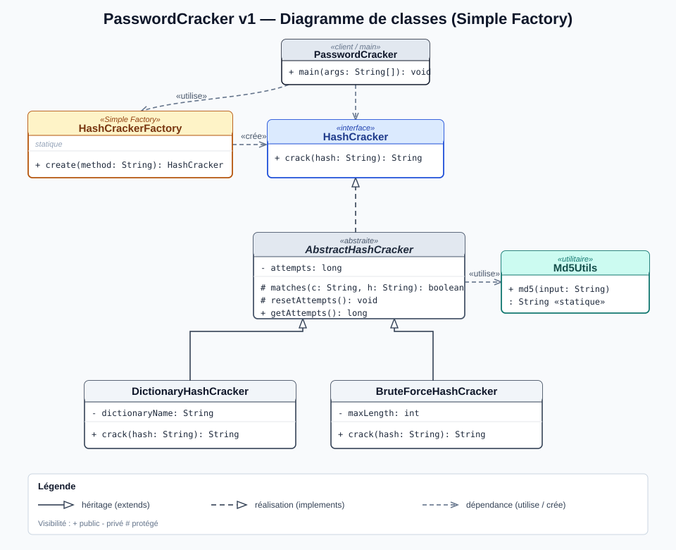

# PasswordCracker v1 — Mise en œuvre du patron *Simple Factory*

Outil en ligne de commande permettant de retrouver un mot de passe à partir de son empreinte **MD5**, par attaque **dictionnaire** ou **force brute**.
Mini-Projet 1 — Patrons de conception.

- **Dépôt GitHub :** https://github.com/mamadou-sow-esp/PasswordCracker
- **Vidéo de présentation :** https://youtu.be/JSp1FYODCbM

---

## Sommaire

1. [Introduction](#1-introduction)
2. [Présentation du problème](#2-présentation-du-problème)
3. [Architecture](#3-architecture)
4. [Diagramme UML](#4-diagramme-uml)
5. [Usage du patron Simple Factory](#5-usage-du-patron-simple-factory)
6. [Résultats obtenus](#6-résultats-obtenus)
7. [Difficultés rencontrées](#7-difficultés-rencontrées)
8. [Conclusion](#8-conclusion)
9. [Compilation et utilisation](#9-compilation-et-utilisation)
10. [Questions de réflexion](#10-questions-de-réflexion)

---

## 1. Introduction

Dans le domaine de la cybersécurité, les mots de passe ne sont jamais stockés en clair : ils sont transformés par une **fonction de hachage cryptographique** (ici MD5). Lors d'un audit, on cherche à évaluer la robustesse de ces mots de passe en tentant de « casser » leur empreinte, c'est-à-dire retrouver le texte en clair à partir du hash.

Ce projet développe une première version d'un outil, **`passwordCracker`**, qui retrouve un mot de passe à partir de son hash MD5. L'objectif pédagogique principal n'est pas l'efficacité du cassage, mais la **conception orientée objet** : structurer proprement plusieurs stratégies interchangeables et centraliser leur création à l'aide du patron de création **Simple Factory**.

**Cadre éthique.** Cet outil est un exercice pédagogique. Le cassage de mots de passe ne doit être réalisé que sur des systèmes dont on est propriétaire ou pour lesquels on dispose d'une autorisation écrite (audit, test d'intrusion). MD5 est par ailleurs considéré comme cryptographiquement cassé et ne doit plus être utilisé pour protéger de vrais mots de passe.

---

## 2. Présentation du problème

L'outil reçoit deux informations. L'argument `-m` indique la méthode de cassage : `BRUTE` pour une attaque par force brute, ou `DICO` pour une attaque par dictionnaire. L'argument `-h` fournit l'empreinte à casser, c'est-à-dire un hash MD5 de 32 caractères hexadécimaux.

Exemples de la consigne :

```bash
passwordCracker -m BRUTE -h e7247759c1633c0f9f1485f3690294a9
passwordCracker -m DICO  -h e7247759c1633c0f9f1485f3690294a9
```

Le programme affiche `Password found: <mot>` en cas de succès, ou `Password not found` sinon, ainsi que des informations complémentaires (temps d'exécution, nombre de tentatives).

Deux stratégies sont attendues. La stratégie par **dictionnaire** parcourt une liste de mots connus ; pour chacun, elle calcule son MD5 et le compare au hash recherché. La stratégie par **force brute** génère exhaustivement toutes les combinaisons de l'alphabet `a…z` jusqu'à une longueur maximale de quatre caractères, et teste chacune d'elles.

**Note sur le hash de l'exemple.** Le hash `e7247759c1633c0f9f1485f3690294a9` donné dans le sujet ne correspond en réalité pas à `md5("test")`. La vraie empreinte de `test` est `098f6bcd4621d373cade4e832627b4f6`. L'outil étant générique, il fonctionne avec n'importe quel hash MD5 réel ; les exemples de ce dépôt utilisent donc les empreintes exactes.

---

## 3. Architecture

Le cœur de la conception repose sur le **polymorphisme** : le programme principal ne manipule qu'une abstraction, `HashCracker`, sans jamais connaître la stratégie concrète réellement utilisée.

Les responsabilités se répartissent ainsi :

- **`HashCracker`** (interface) — contrat commun imposé : la méthode `crack(hash)` retourne le mot trouvé ou `null`.
- **`AbstractHashCracker`** (classe abstraite) — factorise le code commun aux stratégies : comptage des tentatives et comparaison d'un candidat au hash (`matches`). Évite la duplication de code.
- **`DictionaryHashCracker`** — stratégie concrète : recherche dans un dictionnaire de mots.
- **`BruteForceHashCracker`** — stratégie concrète : génération exhaustive des combinaisons `a…z` (longueur inférieure ou égale à 4).
- **`HashCrackerFactory`** (Simple Factory) — point unique de création des stratégies à partir d'une chaîne (`"BRUTE"` ou `"DICO"`).
- **`Md5Utils`** (utilitaire) — calcul centralisé des empreintes MD5.
- **`PasswordCracker`** (client / main) — analyse les arguments, interroge la fabrique, lance le cassage et affiche les résultats.

### Choix de conception

- **Interface imposée respectée.** `HashCracker` ne contient que `crack(String) : String`, exactement comme demandé.
- **Abstraction ajoutée pour éviter la duplication.** La contrainte « éviter les duplications de code » nous a conduits à introduire `AbstractHashCracker` : le calcul MD5, la comparaison et le comptage des tentatives n'existent qu'une seule fois, hérités par les deux stratégies. Le contrat public reste celui de l'interface.
- **Création centralisée.** Aucune classe concrète n'est instanciée directement dans `main` : tout passe par `HashCrackerFactory.create(...)` (contrainte du sujet).

### Arborescence du projet

```
PasswordCracker/
├── README.md                 # ce rapport technique
├── dictionary.txt            # dictionnaire pour l'attaque DICO
├── passwordCracker           # script de lancement (Linux/macOS)
├── passwordCracker.bat       # script de lancement (Windows)
├── docs/
│   ├── uml.svg               # diagramme de classes (rendu)
│   ├── uml.png               # diagramme de classes (aperçu PNG)
│   └── uml.puml              # source PlantUML (éditable)
└── src/com/passwordcracker/
    ├── HashCracker.java          (interface)
    ├── AbstractHashCracker.java  (classe abstraite)
    ├── DictionaryHashCracker.java
    ├── BruteForceHashCracker.java
    ├── HashCrackerFactory.java   (Simple Factory)
    ├── Md5Utils.java             (utilitaire MD5)
    └── PasswordCracker.java      (application console)
```

---

## 4. Diagramme UML



Source éditable : [`docs/uml.puml`](docs/uml.puml)

Relations principales :

- `AbstractHashCracker` **réalise** `HashCracker` (`implements`).
- `DictionaryHashCracker` et `BruteForceHashCracker` **héritent** de `AbstractHashCracker` (`extends`).
- `HashCrackerFactory` **retourne** le type abstrait `HashCracker`, mais **instancie** les classes concrètes `DictionaryHashCracker` et `BruteForceHashCracker` (d'où les deux flèches de dépendance vers ces classes sur le diagramme). C'est cette connaissance des types concrets qui explique la limite Open/Closed du patron.
- `AbstractHashCracker` **utilise** `Md5Utils`.
- `PasswordCracker` **utilise** la fabrique et l'interface, jamais les classes concrètes.

---

## 5. Usage du patron Simple Factory

Le patron **Simple Factory** consiste à déléguer l'instanciation des objets à une classe ou méthode dédiée, plutôt que d'appeler `new` directement dans le code client.

Ici, `HashCrackerFactory` expose une méthode statique unique :

```java
public static HashCracker create(String method) {
    if (method == null) {
        throw new IllegalArgumentException("La méthode ne peut pas être nulle.");
    }
    switch (method.trim().toUpperCase()) {
        case "DICO":  return new DictionaryHashCracker();
        case "BRUTE": return new BruteForceHashCracker();
        default:
            throw new IllegalArgumentException(
                "Méthode inconnue : « " + method + " » (attendu : BRUTE ou DICO)");
    }
}
```

Côté client, la sélection de la stratégie devient triviale et découplée des implémentations :

```java
HashCracker cracker = HashCrackerFactory.create(method); // "DICO" ou "BRUTE"
String password = cracker.crack(hash);
```

Ce que le patron apporte concrètement ici :

- Le `main` ne dépend que de l'abstraction `HashCracker` : il ignore quelles classes concrètes existent.
- La logique de sélection (`switch`) est regroupée en un seul endroit ; si la correspondance chaîne vers classe change, on ne modifie qu'un fichier.
- Ajouter une stratégie n'impacte pas le code client, seulement la fabrique.

---

## 6. Résultats obtenus

Tests réalisés sous Windows (JDK 21, alphabet `a…z`, longueur brute maximale de 4). Les hash utilisés sont les empreintes MD5 réelles des mots testés. Les temps dépendent de la machine.

### Attaque par dictionnaire (`DICO`)

```text
> passwordCracker.bat -m DICO -h 098f6bcd4621d373cade4e832627b4f6
Methode : DICO  |  Hash cible : 098f6bcd4621d373cade4e832627b4f6
Recherche en cours...
--------------------------------------------------
Password found: test
Nombre de tentatives : 6
Temps d'execution   : 0,026 s
```

```text
> passwordCracker.bat -m DICO -h 21232f297a57a5a743894a0e4a801fc3
--------------------------------------------------
Password found: admin
Nombre de tentatives : 3
Temps d'execution   : 0,029 s
```

```text
> passwordCracker.bat -m DICO -h 5ebe2294ecd0e0f08eab7690d2a6ee69
--------------------------------------------------
Password found: secret
Nombre de tentatives : 2
Temps d'execution   : 0,027 s
```

```text
> passwordCracker.bat -m DICO -h ffffffffffffffffffffffffffffffff
--------------------------------------------------
Password not found
Nombre de tentatives : 20
Temps d'execution   : 0,034 s
```

### Attaque par force brute (`BRUTE`)

```text
> passwordCracker.bat -m BRUTE -h fbade9e36a3f36d3d676c1b808451dd7   # md5("z")
--------------------------------------------------
Password found: z
Nombre de tentatives : 26
Temps d'execution   : 0,022 s
```

```text
> passwordCracker.bat -m BRUTE -h 900150983cd24fb0d6963f7d28e17f72   # md5("abc")
--------------------------------------------------
Password found: abc
Nombre de tentatives : 731
Temps d'execution   : 0,036 s
```

```text
> passwordCracker.bat -m BRUTE -h 098f6bcd4621d373cade4e832627b4f6   # md5("test")
--------------------------------------------------
Password found: test
Nombre de tentatives : 355 414
Temps d'execution   : 0,284 s
```

### Cas d'erreur gérés

```text
> passwordCracker.bat -m FOO -h 098f6bcd4621d373cade4e832627b4f6
Methode inconnue : "FOO" (attendu : BRUTE ou DICO)

> passwordCracker.bat -m DICO -h xyz
Hash MD5 invalide : un hash MD5 doit comporter 32 caracteres hexadecimaux.
```

### Synthèse

En dictionnaire, les mots présents sont trouvés quasi instantanément : `test` en 6 tentatives (0,026 s), `admin` en 3 tentatives (0,029 s), `secret` en 2 tentatives (0,027 s) ; un hash absent du dictionnaire épuise les 20 mots en 0,034 s et renvoie `Password not found`. En force brute, `z` (1 lettre) demande 26 tentatives (0,022 s), `abc` (3 lettres) 731 tentatives (0,036 s), et `test` (4 lettres) 355 414 tentatives (0,284 s).

On observe nettement la différence de coût : le dictionnaire est immédiat quand le mot y figure, tandis que la force brute croît de façon exponentielle avec la longueur. L'espace de recherche `a…z` de longueur 1 à 4 compte 475 254 combinaisons (26 + 26² + 26³ + 26⁴), ce qui explique le bond du nombre de tentatives dès quatre caractères.

### Vidéo de présentation

La vidéo de démonstration de l'exécution de l'outil est disponible ici : **https://youtu.be/JSp1FYODCbM**

---

## 7. Difficultés rencontrées

- **Éviter la duplication de code.** Les deux stratégies partagent le calcul MD5 et la comparaison. La solution retenue (classe abstraite `AbstractHashCracker` et utilitaire `Md5Utils`) centralise ce comportement tout en respectant l'interface imposée.
- **Ordre de génération en force brute.** Générer les combinaisons dans le bon ordre (`a, b, …, z, aa, ab, …`) a nécessité une génération récursive longueur par longueur, avec arrêt anticipé dès qu'une correspondance est trouvée.
- **Affichage des accents.** Selon la locale du système, la sortie console pouvait remplacer les accents par des points d'interrogation. Le programme force désormais l'encodage UTF-8 sur `System.out` et `System.err`.
- **Localisation du dictionnaire.** Pour que l'outil fonctionne sans configuration, le dictionnaire est cherché d'abord sur le disque, puis dans les ressources embarquées (classpath).
- **Incohérence du hash d'exemple.** Le hash du sujet ne correspondait pas à `test` ; nous l'avons vérifié et documenté plutôt que de le reproduire aveuglément.

---

## 8. Conclusion

Cette première version atteint tous les objectifs : une architecture orientée objet modulaire, l'usage du polymorphisme, la mise en œuvre du patron **Simple Factory**, et une application console fonctionnelle validée par des tests.

Le patron Simple Factory apporte un réel gain de découplage : le code client ignore les classes concrètes et la création est centralisée. Sa limite apparaît toutefois clairement : ajouter une stratégie oblige à modifier la fabrique (un nouveau `case`), ce qui viole le principe **Open/Closed**. Cette limite sera précisément l'objet du mini-projet suivant, qui remplacera la fabrique simple par un mécanisme extensible (par exemple une *Factory Method* ou un enregistrement de stratégies).

---

## 9. Compilation et utilisation

Prérequis : un JDK (Java 17 ou supérieur).

### Option A — script fourni (recommandé)

Le script compile automatiquement au besoin, puis exécute l'outil :

```bash
# Linux / macOS
chmod +x passwordCracker
./passwordCracker -m DICO  -h 098f6bcd4621d373cade4e832627b4f6
./passwordCracker -m BRUTE -h 900150983cd24fb0d6963f7d28e17f72
```

```bat
:: Windows
passwordCracker.bat -m DICO -h 098f6bcd4621d373cade4e832627b4f6
```

### Option B — compilation manuelle

```bash
# Compilation
javac -d out $(find src -name "*.java")
cp dictionary.txt out/         # pour l'attaque par dictionnaire

# Exécution (depuis la racine du projet)
java -cp out com.passwordcracker.PasswordCracker -m DICO -h 098f6bcd4621d373cade4e832627b4f6
```

Pour tester avec vos propres mots :

```bash
echo -n "monmotdepasse" | md5sum      # récupérer le hash
./passwordCracker -m DICO -h <le_hash_obtenu>
```

---

## 10. Questions de réflexion

### 1. Quels avantages apporte la fabrique simple ?

- **Centralisation** de la création : toute la logique de sélection est à un seul endroit.
- **Découplage** : le code client dépend de l'abstraction `HashCracker`, pas des classes concrètes ; il n'a jamais à écrire `new DictionaryHashCracker()`.
- **Lisibilité et maintenance** : le client se résume à `create(method)` puis `crack(hash)`.
- **Point de contrôle unique** : validation des entrées, journalisation ou configuration peuvent être ajoutées au même endroit.

### 2. Quels sont ses inconvénients ?

- **Non extensible sans modification** : ajouter une stratégie impose d'éditer la méthode `create` (violation du principe Open/Closed).
- **Couplage de la fabrique** : `HashCrackerFactory` doit connaître toutes les classes concrètes.
- **Croissance du `switch`** : la méthode grossit avec chaque nouvelle stratégie, ce qui la rend plus difficile à maintenir.
- Ce n'est pas un véritable patron du « Gang of Four » mais un idiome de programmation ; il ne gère pas les cas complexes (hiérarchies de fabriques, familles de produits).

### 3. Que faut-il modifier lorsqu'une nouvelle stratégie est ajoutée ?

Il faut d'abord créer la nouvelle classe (par exemple `RainbowTableHashCracker`) héritant de `AbstractHashCracker`, puis modifier `HashCrackerFactory.create(...)` pour y ajouter un nouveau `case` associant une chaîne à cette classe.

Le code client (`main`) n'a pas besoin d'être modifié : c'est justement l'intérêt du patron. En revanche, la nécessité de toucher à la fabrique est sa faiblesse.

### 4. La fabrique respecte-t-elle le principe Open/Closed ?

Non. Le principe Open/Closed stipule qu'une classe doit être ouverte à l'extension mais fermée à la modification. Or, chaque nouvelle stratégie oblige à modifier le code source de `HashCrackerFactory` (ajout d'un `case`). La fabrique n'est donc pas fermée à la modification.

---
